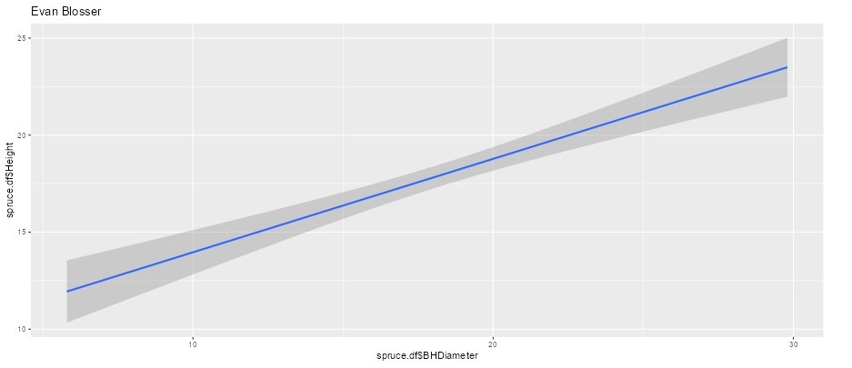
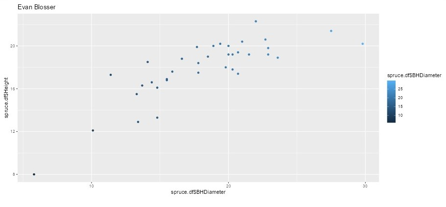
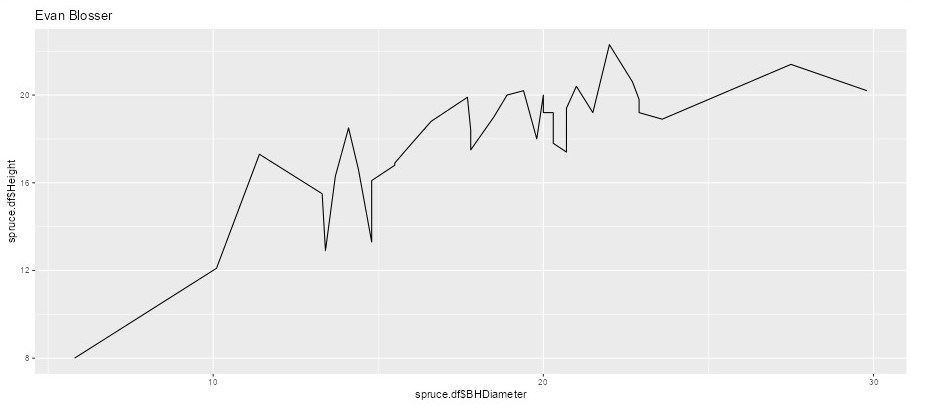

```{r setup, include=FALSE, fig.align='center'}
knitr::opts_chunk$set(echo = TRUE)
```


# Task 1


```{r}
getwd()
```

# Task 2
```{r}
spruce.df <- read.csv("SPRUCE.csv")
head(spruce.df)
```


# Task 3 

## Scatter Plot
```{r}
plot(Height~BHDiameter, main = "Tree Height vs BHDiameter",
     xlab = "Breast Height Diameter (cm)", ylab = "Height of Tree (m)",
     pch = 21, bg = "blue", cex = 1.2,
     xlim = c(0, max(BHDiameter) * 1.1), ylim = c(0, max(Height) * 1.1),
     data = spruce.df)
spruce.lm = with(spruce.df, lm(Height~BHDiameter))
```


## Does there appear to be a straight line relationship?
No, this does not seem like a straight line relation, and if it was it would have mant outliers. 


## Trendscatter plots
```{r}
tstwo = s20x::trendscatter(Height~BHDiameter, f = 0.5, data = spruce.df)
tstwo = s20x::trendscatter(Height~BHDiameter, f = 0.6, data = spruce.df)
tstwo = s20x::trendscatter(Height~BHDiameter, f = 0.7, data = spruce.df)
```


## New Scatter, abline(spruce.lm)
```{r}
plot(Height~BHDiameter, main = "Tree Height vs BHDiameter",
     xlab = "Breast Height Diameter (cm)", ylab = "Height of Tree (m)",
     pch = 21, bg = "blue", cex = 1.2,
     xlim = c(0, max(BHDiameter) * 1.1), ylim = c(0, max(Height) * 1.1),
     data = spruce.df)
spruce.lm = with(spruce.df, lm(Height~BHDiameter))
abline(spruce.lm)
```


## Comments on Graph, is the straight line appropriate?
I would say the straight line is **NOT** an appropriate best fit as the relationship of data itself is not linear. It would seem that a *curve* would be a better fit.


# Task4 

## layout.show(4)
```{r}
layout(matrix(1:4, nr=2,nc=2))
layout.show(4)
```

## 4 plots
```{r}
layout(matrix(1:4, nr=2,nc=2))
mycex = 1.0

# Scatter plot and fitted line
with(spruce.df, 
     plot(Height~BHDiameter, main = "Tree Height vs BHDiameter",
          xlab = "Breast Height Diameter (cm)", ylab = "Height of Tree (m)",
          bg = "Blue", pch=21, cex = mycex, 
          ylim = c(0, 1.1 * max(Height)), xlim = c(0, 1.1 * max(BHDiameter)))
)
abline(spruce.lm)

# Residual line segments
# make yhat the estimates of E[Height | BHDiameter]
yhat = with(spruce.df, predict(spruce.lm, data.frame(BHDiameter)))
# OR you could use -- (yhat values the predicted values for all the BHDiameter values )
yhat = fitted(spruce.lm)

with(spruce.df, 
     plot(Height~BHDiameter, main = "RSS",
          xlab = "Breast Height Diameter (cm)", ylab = "Height of Tree (m)",
          bg = "Blue", pch=21, cex = mycex, 
          ylim = c(0, 1.1 * max(Height)), xlim = c(0, 1.1 * max(BHDiameter)))
)

# Draw in segments making the residuals (regression deviations)
with(spruce.df, {
  segments(BHDiameter, Height, BHDiameter, yhat)
})
abline(spruce.lm)

# Mean and model line segments
with(spruce.df, 
     plot(Height~BHDiameter, main = "MSS",
          xlab = "Breast Height Diameter (cm)", ylab = "Height of Tree (m)",
          bg = "Blue", pch=21, cex = mycex, 
          ylim = c(0, 1.1 * max(Height)), xlim = c(0, 1.1 * max(BHDiameter)))
)
with(spruce.df, abline(h = mean(Height)))

with(spruce.df, segments(BHDiameter, mean(Height), BHDiameter, yhat, col = "Red"))
abline(spruce.lm)

# Mean and total deviation line segments
with(spruce.df, 
     plot(Height~BHDiameter, main = "TSS - Plot by Possible Student",
          xlab = "Breast Height Diameter (cm)", ylab = "Height of Tree (m)",
          bg = "Blue", pch=21, cex = mycex, 
          ylim = c(0, 1.1 * max(Height)), xlim = c(0, 1.1 * max(BHDiameter)))
)
with(spruce.df, abline(h = mean(Height)))
with(spruce.df, segments(BHDiameter, Height, BHDiameter, mean(Height), col = "Green"))
```

## TSS,MSS, & RSS Calculations

The ratio of $\frac{MSS}{TSS}$, or the coefficient of determination, Shows that the straight line model is not the best fit for the given data.

Yes $TSS = MSS+RSS$, as can be seen in the calculations above $ 278.9475=278.9475$

```{r}
#make a new plot
RSS=with(spruce.df,sum((Height-yhat)^2))

RSS

MSS=with(spruce.df,sum((yhat-mean(Height))^2))
MSS

TSS=with(spruce.df,sum((Height-mean(Height))^2))
TSS
RSS + MSS

Ratio <- MSS/TSS
Ratio
```


# Task 5

## summary(spruce.lm) & coef()
```{r}
summary(spruce.lm)
coef(spruce.lm)
```

## Slope
The slope is approximatly $0.48147$

## Intercept
The intercept is approximately $9.14684$

## Equation of fitted line
$$
Height=9.14684 + 0.48147\cdot BHDiameter
$$
## predict(spruce.lm)
```{r}

predict(spruce.lm, data.frame(BHDiameter=c(15,18,20)))
```


# Task 6

```{r}
library(dplyr)
library(ggplot2)
g=ggplot(spruce.df, aes(x=BHDiameter,y=Height,colour=BHDiameter))
g=g+geom_point() + geom_line()+ geom_smooth(method="lm")
g+ggtitle("Heieght Vs BHDiameter")

```


# Task 7
The following are **myTask 7** output:

<center>
{ width=70% }
</center>

<center>
{ width=70% }
</center>

<center>
{ width=70% }
</center>

