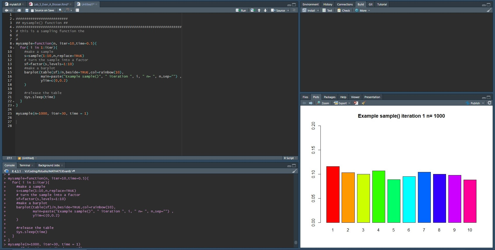

```{r setup, include=FALSE}
knitr::opts_chunk$set(echo = TRUE)
```

# Task 1
```{r}
getwd()
```

# Task 2
```{r}
######################
## mybin() function ##
################################################################################
#
# This is a binomial sampling function
#
# User inuputs:
#   -iter = iterations
#   -n    = sample size
#   -p    = probability
# set default values/replaced with scan()?
#
# Function name and inputs
mybin=function(iter=100,n=10, p=0.5){
###
  # Set Matrix "sam.mat" to be an empty matrix
  #   with the dimensions as the inputs where
  #   -Number of columns are iterations
  #   -Number of rows is 'n' sample size
  sam.mat=matrix(NA,nr=n,nc=iter, byrow=TRUE)
  #
  # Create and empty success vector
  succ=c()
  #
  # Iteration loop of function that samples 1 & 0 as
  #  success or failure, and logs them into the empty
  #  succ vector.
  for( i in 1:iter){
    # The matrix is filled by a sample of the vector c(1, 0) as success/failure
    # with a probability of p & 1-p.
    sam.mat[,i]=sample(c(1,0),n,replace=TRUE, prob=c(p,1-p))
    # As we define the 1 as a success, summing the matrix
    # will give the quantity of success as the 0's will not 
    # change the summation.
    succ[i]=sum(sam.mat[,i])
  }
  # Create a table out of the "success" or succ vector
  succ.tab=table(factor(succ,levels=0:n))
  # Create a barplot to show the "success" vector divided by iterations
  barplot(succ.tab/(iter), col=rainbow(n+1), main="Binomial simulation", xlab="Number of successes")
  # Prints the data used for the bar plot success/iterations
  succ.tab/iter
}
# Call mybin() 
#   input variations as desired
#
```

## Iterations = 100

```{r}
mybin(iter=100,n=10, p=0.7)
```

## Iterations = 200

```{r}
mybin(iter=200,n=10, p=0.7)
```

## Iterations = 500

```{r}
mybin(iter=500,n=10, p=0.7)
```

## Iterations = 1,000

```{r}
mybin(iter=1000,n=10, p=0.7)
```

## Iterations = 10,000

```{r}
mybin(iter=10000,n=10, p=0.7)
```

## Verifying the 10,000 iteration table:
```{r}
dbinom(x = 0, size =10, prob = 0.7 )
dbinom(x = 1, size =10, prob = 0.7 )
dbinom(x = 2, size =10, prob = 0.7 )
dbinom(x = 3, size =10, prob = 0.7 )
dbinom(x = 4, size =10, prob = 0.7 )
dbinom(x = 5, size =10, prob = 0.7 )
dbinom(x = 6, size =10, prob = 0.7 )
dbinom(x = 7, size =10, prob = 0.7 )
dbinom(x = 8, size =10, prob = 0.7 )
dbinom(x = 9, size =10, prob = 0.7 )
dbinom(x = 10, size =10, prob = 0.7 )
```
## Task 2 summary
  Comparing results from the 10,000 iteration run of mybin() to that of "dbinom"
  it can be seen that the values are indeed approximately correct. Assuming we note that 
  $5.9049\times e^{6}$ is approximately zero.


# Task 3

## sample()

There are 20 marbles, population, with $12$ being white and denoted as "1" in the simulation
  , probability is $\frac{3}{5}$, and $8$ being black denoted as "0" with probability $\frac{2}{5}$.

Thus, we have a sample size of 5 **WITHOUT** replacement:
```{r}
Marble.bag  <- c(1,1,1,1,1,1,1,1,1,1,1,1,0,0,0,0,0,0,0,0)
Marble.prob <- c(3/5,3/5,3/5,3/5,3/5,3/5,3/5,3/5,3/5,3/5,3/5,3/5,2/5,2/5,2/5,2/5,2/5,2/5,2/5,2/5)
sample(Marble.bag,size=5,prob=Marble.prob, replace=FALSE)
```
**with**
```{r}
Marble.bag  <- c(1,1,1,1,1,1,1,1,1,1,1,1,0,0,0,0,0,0,0,0)
Marble.prob <- c(3/5,3/5,3/5,3/5,3/5,3/5,3/5,3/5,3/5,3/5,3/5,3/5,2/5,2/5,2/5,2/5,2/5,2/5,2/5,2/5)
sample(Marble.bag,size=5,prob=Marble.prob, replace=TRUE)
```

## myhyper()
```{r}
myhyper=function(iter=100,N=20,r=12,n=5){
# make a matrix to hold the samples
#initially filled with NA's
sam.mat=matrix(NA,nr=n,nc=iter, byrow=TRUE)
#Make a vector to hold the number of successes over the trials
succ=c()
for( i in 1:iter){
#Fill each column with a new sample
sam.mat[,i]=sample(rep(c(1,0),c(r,N-r)),n,replace=FALSE)
#Calculate a statistic from the sample (this case it is the sum)
succ[i]=sum(sam.mat[,i])
}
#Make a table of successes
succ.tab=table(factor(succ,levels=0:n))
#Make a barplot of the proportions
barplot(succ.tab/(iter), col=rainbow(n+1), main="HYPERGEOMETRIC simulation", xlab="Number of successes")
succ.tab/iter
}
# cmd: myhyper(iter=1000,n=19, N=20,r=12)

# cmd: dhyper(x=0:19, m=12, n=8, k=19)
```

## Iterations = 100

```{r}
myhyper(iter=100,n=5,N=20,r=12)
```

## Iterations = 200
```{r}
myhyper(iter=200,n=5,N=20,r=12)
```

## Iterations = 500
```{r}
myhyper(iter=500,n=5,N=20,r=12)
```

## Iterations = 1,000
```{r}
myhyper(iter=1000,n=5,N=20,r=12)
```

## Iterations = 10,000
```{r}
myhyper(iter=10000,n=5,N=20,r=12)
```


## Verifying the 10,000 iteration table:
```{r}
dhyper(x=0:19, m=12, n=8, k=19)
```
these are approximatly correct given that the setting n = 10 gives an identical distribution to **dhyper**
```{r}
myhyper(iter=10000,n=10,N=20,r=12)
```


# Task 4



## What this function does:
 This function **mysample()** takes a sample of numbers 1 through 10, with replacement, and creates a new set of probability graphs for each of the 30 iterations.It also slows down the knitting process significantly which is why a screenshot was included of it running in a .R script. 

 All the graphs are slightly different yet their probabilities for numbers 1 through 10 all center around $0.10$
  or it can be seen that all numbers have an almost equal chance of being selected by **mysample()**. 


# Task 5

## Bullet 1

```{r}
choose(8,4)
```
This can be verified by the equation:
```{r}
factorial(8)/(factorial(4)*factorial(4))
```

## Bullet 2

```{r}
1 - dpois(4,lambda = 2)
```


## Bullet 3
```{r}
mynbin=function(y,r,p){
choose(y-1,r-1)*p^r*(1-p)^(y-r)
}
mynbin(10,3,0.4)
```


## Bullet 4
```{r}
pbinom(8,15,0.4)
```


# Task 6
```{r}
MATH4753EvanB::neg.bi.nom(10,3,0.4)
```


# Task 7

My best attempt at **task 7**

```{r}
neg.binom.sim=function(mu =5, r=100){
  ###
  p = r/mu
  succ = 0
  while(succ<r){
    # Relations
    y= x + r
    q = 1-p
    sigma = sqrt((r*q)/p^2)
    # Probability density
    prob.neg.bi <- choose(y-1,r-1)*p^r*(1-p)^(y-r)
    # Sampling 1's and 0's
    sample.neg<-sample(c(1,0),replace=TRUE)
    if (sample.neg == 0){
      x = x + 1
      succ = succ + 1
    }
    
  }

}

###
# if we have a relitive frequency we can use dnbinom to check

```


```{r}
x <- 0:15
size <- (1:20)/4
persp(x, size, dnb <- outer(x, size, function(x,s) dnbinom(x, s, prob = 0.4)),
      xlab = "x", ylab = "s", zlab = "density", theta = 150)
title(tit <- "negative binomial density(x,s, pr = 0.4)  vs.  x & s")
```


